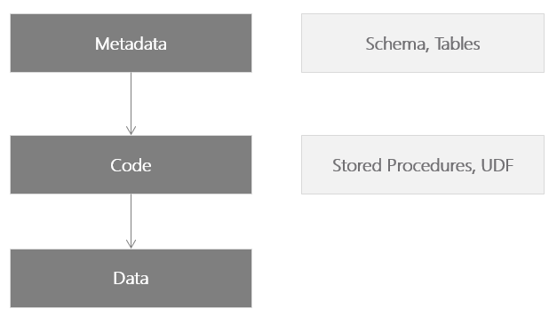
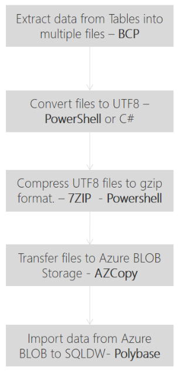
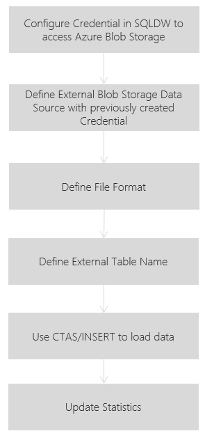

The following is a high level workflow of the data migration to Azure SQL Data Warehouse.
The migration requires migrating all
1. Metadata : Table Schema, Tables
2. Code : All Stored Procedure, Functions etc. The code may require additional customisation based on the compatibility for Azure SQL Data Warehouse. Otherwise, this can be a simple script generation from SQL Server
3. Data : Migrating data requires additional planning and need to consider the size of the table, how should the table be distributed and the Index type.

The following flow illustrates the process for migrating the meta data along with the data to Azure SQL Data Warehouse.

The last table to **Import data from Azure BLOB to SQL DW** requires additional steps.

